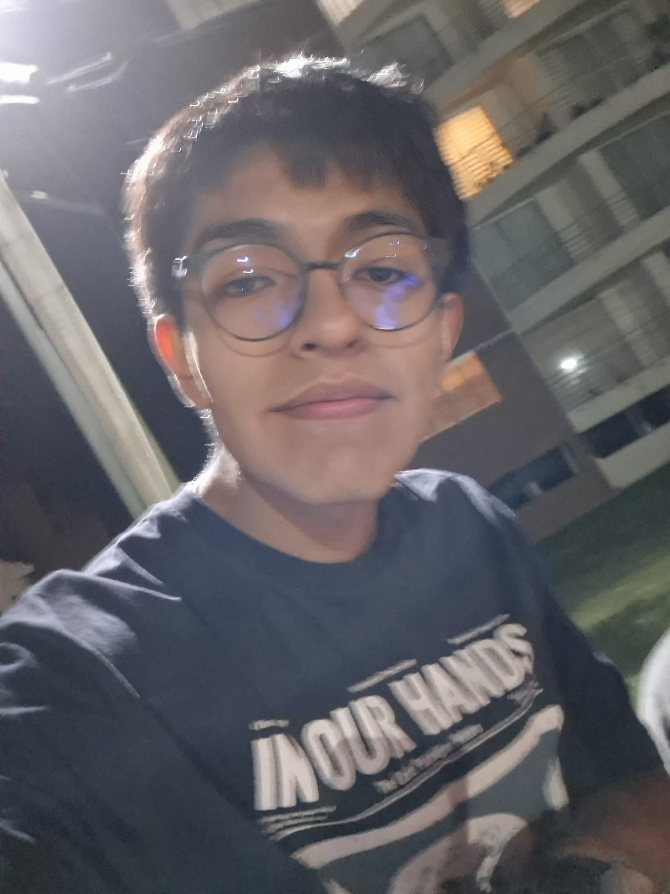
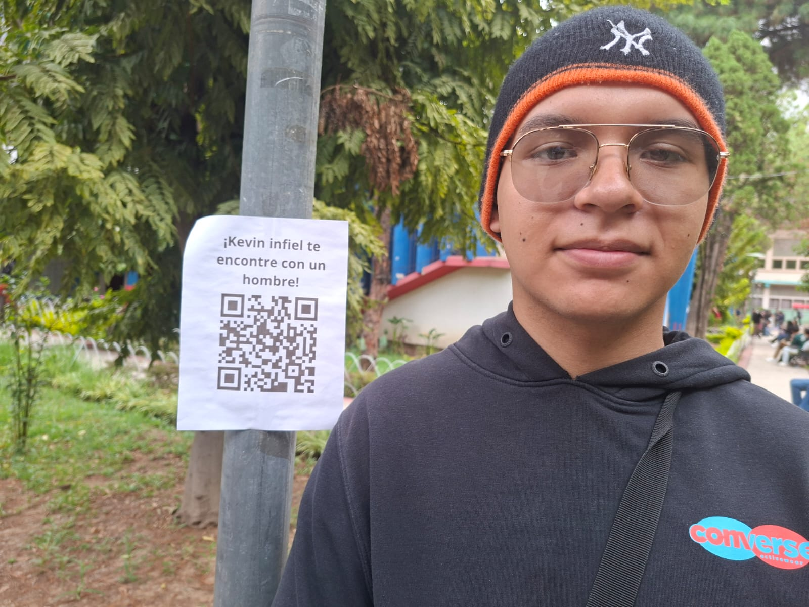
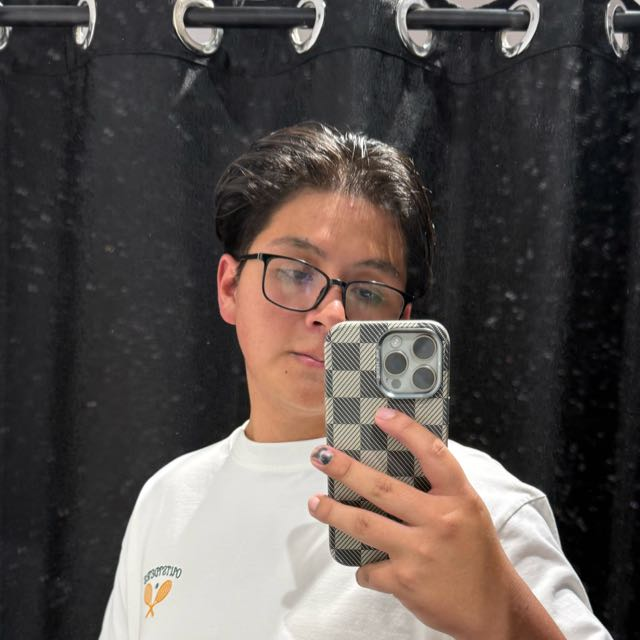
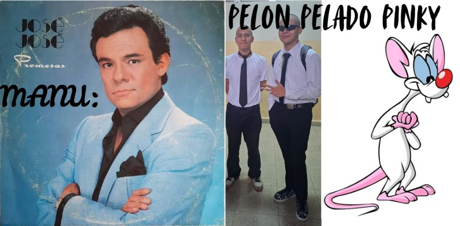

# PELON PELADO PINKY Y MANU

# TO DO LIST

## INTEGRANTES
 
Alejandro Jorge Caceres Alvarez
ucaceresalejandro757@gmail.com

  

Kevin Alfredo Burgulla Muriel
kevinburgulla@gmail.com

  

Manuel Jotan Lazarte Ascuy
Manuellink2@gmail.com

  

 
Agustín Leonardo Arnez Alcocer 

## BANER

  

## EL PROYECTO

Este proyecto es una aplicación web de un to do list en  frontend (HTML, CSS y JavaScript), por lo que no requiere instalación de dependencias ni servidores adicionales.

Para ejecutarlo:

Ubique el archivo principal:
index.html
Abra el archivo de alguna de estas formas:
Opción 1 — Doble clic

Hacer doble clic sobre index.html

Opción 2 — Desde Visual Studio Code
Abrir la carpeta del proyecto
Instalar la extensión Live Server
Click derecho sobre index.html
Seleccionar:
Open with Live Server

Opción 3 — Desde GitHub Pages (si está habilitado)

Acceder al enlace publicado del proyecto:

https://aguss-afk.github.io/friendly-winner/
